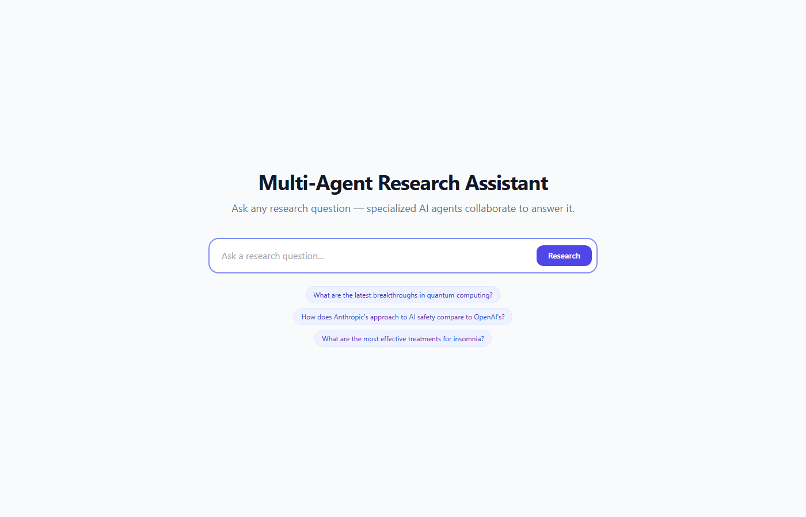
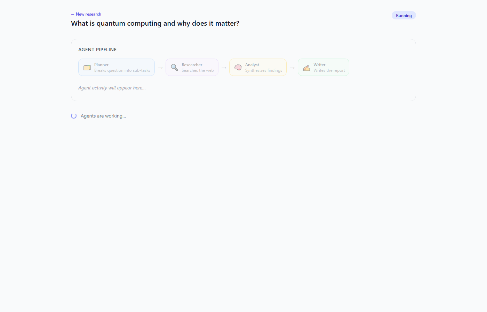
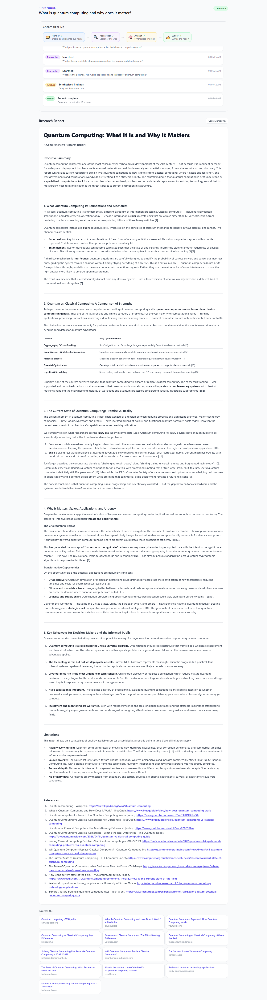

# Multi-Agent Research Assistant

A full-stack web application where specialized AI agents collaborate in real-time
to answer complex research questions. Built as a portfolio project for AI/ML
Engineer and Agentic AI roles.

## Architecture

```
User Question
     │
     â–¼
┌─────────────────────────────────────────────────────────────┐
│                    LangGraph State Machine                  │
│                                                             │
│  ┌──────────┐    ┌────────────┐    ┌─────────┐    ┌──────┐ │
│  │ Planner  │───▶│ Researcher │───▶│ Analyst │───▶│Writer│ │
│  │          │    │            │    │         │    │      │ │
│  │Breaks    │    │Tavily web  │    │Synthesize    │Write │ │
│  │question  │    │search per  │    │findings │    │MD    │ │
│  │into 3-5  │    │sub-task    │    │& gaps   │    │report│ │
│  │sub-tasks │    │            │    │         │    │      │ │
│  └──────────┘    └────────────┘    └─────────┘    └──────┘ │
│       │               │                │              │    │
│       └───────────────┴────────────────┴──────────────┘    │
│                          error_handler (any node)           │
└─────────────────────────────────────────────────────────────┘
     │
     â–¼ FastAPI SSE stream
     │
     â–¼
React UI — real-time agent timeline + final Markdown report
```

### Agent Roles

| Agent | Role | LLM |
|---|---|---|
| **Planner** | Decomposes the query into 3-5 searchable sub-questions | Claude claude-sonnet-4-6 |
| **Researcher** | Calls Tavily search for each sub-question, collects top 3 results | Tavily API |
| **Analyst** | Synthesizes all search results, notes contradictions and uncertainty | Claude claude-sonnet-4-6 |
| **Writer** | Produces a structured Markdown report with citations | Claude claude-sonnet-4-6 |

## Tech Stack

| Layer | Technology |
|---|---|
| Agent orchestration | LangGraph + LangChain |
| LLM | Anthropic Claude claude-sonnet-4-6 |
| Web search | Tavily API |
| Backend | FastAPI + SSE streaming |
| Frontend | React 18 + Vite + Tailwind CSS |
| Containerization | Docker + docker-compose |

## Prerequisites

- [Docker Desktop](https://www.docker.com/products/docker-desktop/) (includes docker-compose)
- Anthropic API key — [console.anthropic.com](https://console.anthropic.com)
- Tavily API key (free tier) — [tavily.com](https://tavily.com)

> Alternatively, without Docker: Python 3.11+ and Node 18+

## Quick Start

### 1. Clone the repo
```bash
git clone <your-repo-url>
cd multi-agent-research
```

### 2. Add API keys
```bash
cp .env.example .env
# Edit .env and fill in your keys:
#   ANTHROPIC_API_KEY=sk-ant-...
#   TAVILY_API_KEY=tvly-...
```

### 3. Run with Docker
```bash
docker-compose up --build
```

Open **http://localhost:5173** in your browser.

### Running without Docker

**Backend:**
```bash
cd backend
python -m venv .venv
source .venv/bin/activate   # Windows: .venv\Scripts\activate
pip install -r requirements.txt
uvicorn main:app --reload --port 8000
```

**Frontend:**
```bash
cd frontend
npm install
npm run dev
```

## Getting API Keys

### Anthropic API Key
1. Go to [console.anthropic.com](https://console.anthropic.com)
2. Sign up / log in → API Keys → Create Key
3. Copy the `sk-ant-...` key into `.env`

### Tavily API Key (free tier — 1,000 searches/month)
1. Go to [app.tavily.com](https://app.tavily.com)
2. Sign up → Dashboard → API Keys
3. Copy the `tvly-...` key into `.env`

## Example Queries

- *"What are the most promising applications of large language models in healthcare?"*
- *"What are the latest breakthroughs in quantum computing?"*
- *"How does Anthropic's approach to AI safety compare to OpenAI's?"*
- *"What are the most effective evidence-based treatments for insomnia?"*
- *"What is the current state of fusion energy research?"*

## Project Structure

```
multi-agent-research/
├── backend/
│   ├── main.py               # FastAPI app — REST + SSE endpoints
│   ├── graph.py              # LangGraph state machine
│   ├── models.py             # ResearchState TypedDict
│   ├── agents/
│   │   ├── planner.py        # Decomposes query → sub-tasks (JSON)
│   │   ├── researcher.py     # Tavily search per sub-task
│   │   ├── analyst.py        # Synthesizes search results
│   │   └── writer.py         # Produces final Markdown report
│   ├── tools/
│   │   └── search.py         # Tavily client wrapper
│   ├── requirements.txt
│   └── Dockerfile
├── frontend/
│   ├── src/
│   │   ├── App.jsx            # Main app — state + SSE wiring
│   │   ├── components/
│   │   │   ├── QueryInput.jsx     # Search box + example chips
│   │   │   ├── AgentTimeline.jsx  # Pipeline stations + log feed
│   │   │   ├── AgentCard.jsx      # Individual log entry
│   │   │   └── FinalReport.jsx    # Markdown report + sources
│   │   └── index.css
│   ├── package.json
│   ├── vite.config.js
│   └── Dockerfile
├── docker-compose.yml
├── .env.example
└── README.md
```

## How It Works

1. **User submits a query** → `POST /api/research` → returns `session_id`
2. **Frontend opens an SSE stream** → `GET /api/research/{session_id}/stream`
3. **LangGraph runs in a background thread**, emitting events to a per-session queue
4. **FastAPI SSE generator polls the queue** and forwards events as `agent_update` / `complete` / `error`
5. **Frontend renders** log entries in real-time, then fades in the final Markdown report

The entire pipeline runs inside a 180-second timeout. If any agent fails, the
state machine routes to an `error_handler` node and the frontend shows the
error message.

## Screenshots

**Home — enter any research question:**



**Agents working — live pipeline view:**



**Result — full structured research report with citations:**



## Future Improvements

- **Agent memory** — persist prior research sessions so the Analyst can reference earlier findings
- **More tools** — add Wikipedia, ArXiv, Google Scholar adapters
- **Streaming LLM output** — stream token-by-token from Claude for faster perceived response
- **User-selectable depth** — quick (1 search/task) vs deep (5 searches/task)
- **Export options** — download as PDF or Notion page
- **Fine-tuning** — fine-tune the Writer agent on high-quality research reports
- **Caching** — cache Tavily results for identical sub-queries
- **Auth + history** — save past research sessions per user
