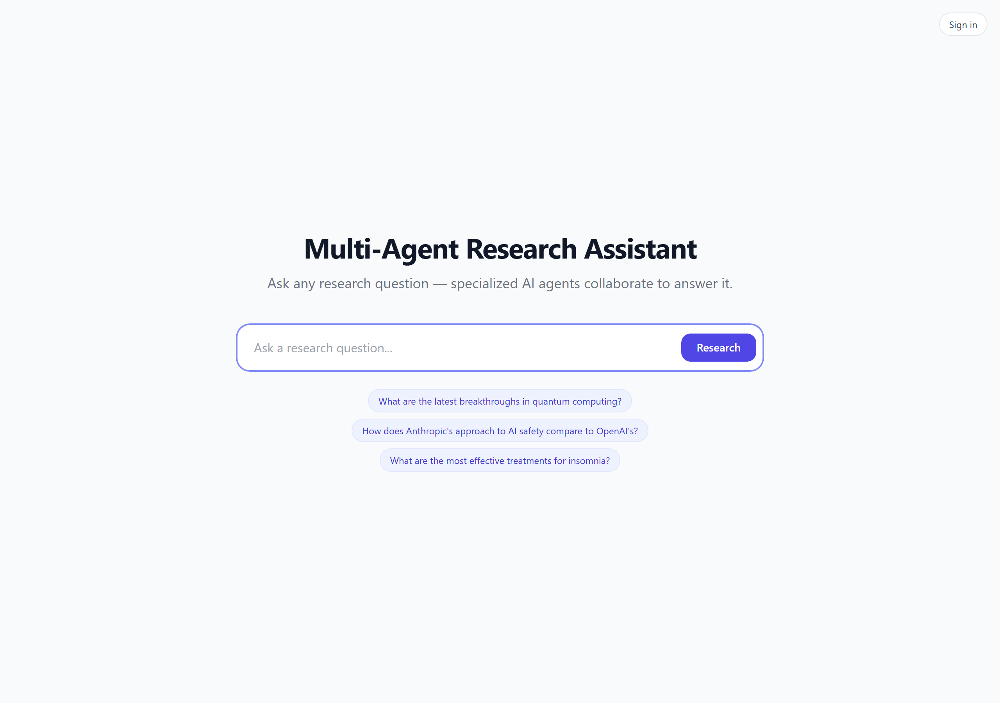
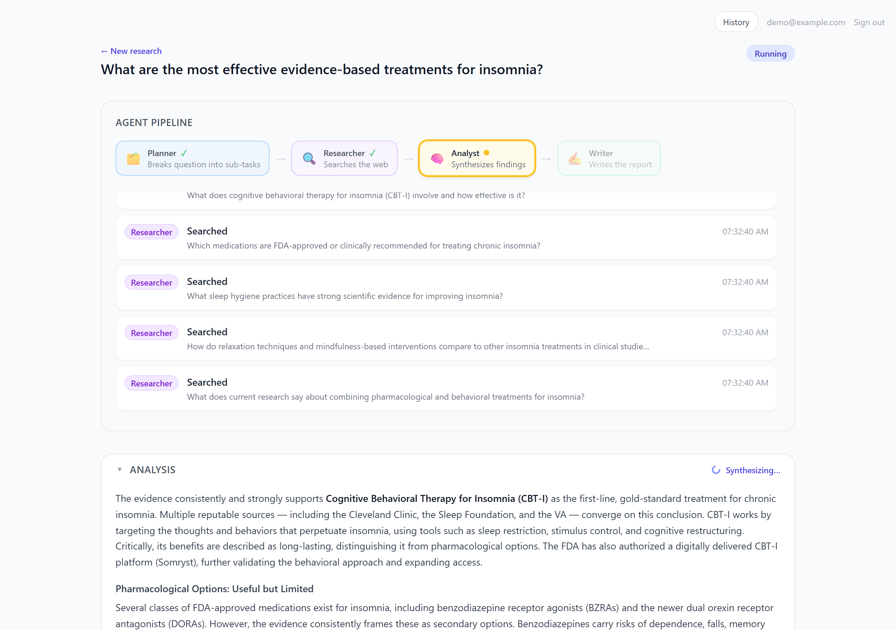
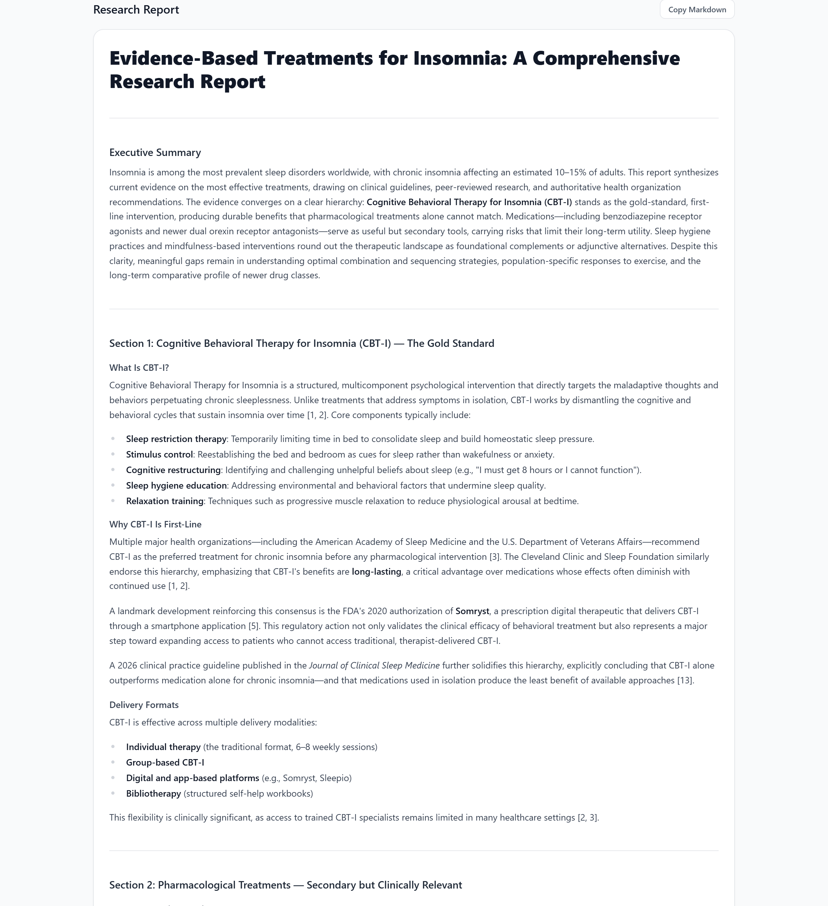
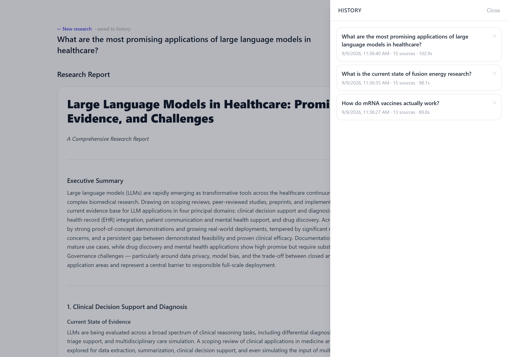

# Multi-Agent Research Assistant

Ask a research question and four specialized AI agents work through it together:
one plans, one searches the web, one synthesizes, one writes. You watch them work
in real time and get back a sourced Markdown report with citations.

Built as a portfolio project for AI/ML Engineer and Agentic AI roles.

```
                     "What is the Doppler effect?"
                                  |
                                  v
+---------------------------------------------------------------------------+
|                         LangGraph State Machine                           |
|                                                                           |
|  +---------+    +------------+    +---------+    +--------+               |
|  | Planner |--->| Researcher |--->| Analyst |--->| Writer |               |
|  |         |    |            |    |         |    |        |               |
|  | Breaks  |    | Tavily     |    |Synthesize   | Streams |               |
|  | question|    | searches,  |    | findings|   | the MD  |               |
|  | into 3-5|    | run in     |    | & gaps, |   | report  |               |
|  |sub-tasks|    | parallel   |    | streams |   |         |               |
|  +---------+    +-----+------+    +---------+   +--------+                |
|                       |  ^                                                |
|            thin pass? |  | refined queries                                |
|                       v  |                                                |
|                  +-----------+                                            |
|                  |  Refiner  |  rewrites sub-questions that found nothing |
|                  +-----------+  (bounded by MAX_RESEARCH_RETRIES)         |
|                                                                           |
|            error_handler <-- any node that sets state["error"]            |
+---------------------------------------------------------------------------+
                                  |
                                  v  FastAPI SSE stream
                                  |
                    React UI: live agent timeline,
                    analysis and report streaming in
```

### Agent roles

| Agent | Role | Backed by |
|---|---|---|
| **Planner** | Decomposes the query into 3-5 searchable sub-questions | Claude Sonnet 4.6 |
| **Researcher** | Tavily search per sub-question, run in parallel, top 3 results each | Tavily API |
| **Refiner** | Rewrites sub-questions that returned nothing, so they can be retried | Claude Sonnet 4.6 |
| **Analyst** | Synthesizes results, notes contradictions and unevidenced gaps | Claude Sonnet 4.6 |
| **Writer** | Streams a structured Markdown report with citations | Claude Sonnet 4.6 |

The Researcher to Refiner to Researcher edge is conditional: it only fires when a
pass leaves most sub-questions unanswered and retry budget remains. That
branching is the reason this is a state graph rather than a linear chain, and it
is why the Refiner is not simply another step in the sequence. See
[ADR-001](docs/architecture-decisions.md).

## What it does

- **Live progress.** Each agent reports as it finishes, and both the analysis and
  the report stream in token by token. First visible output lands around 16
  seconds into a roughly 75-second run.
- **Real sources.** Every claim traces to a URL the Researcher actually fetched.
  Typically 13-15 sources per report.
- **Honest failure.** A search that ran and found nothing is treated differently
  from a search that could not run at all. The Analyst refuses to write from zero
  sources rather than inventing a confident answer.
- **Accounts and history**, optional. Research works signed out; signing in saves
  each run so you can reopen it.
- **Caching and parallelism.** Sub-question searches run concurrently and results
  are reused for six hours, so a repeated question costs almost nothing.

## Tech stack

| Layer | Technology |
|---|---|
| Agent orchestration | LangGraph |
| LLM | Anthropic Claude Sonnet 4.6 (`claude-sonnet-4-6`) |
| Web search | Tavily API |
| Backend | FastAPI, SSE streaming |
| Frontend | React 18, Vite, Tailwind CSS |
| Accounts | SQLAlchemy, Argon2, JWT |
| Shared state | Redis (optional) |
| Containerization | Docker, docker-compose |
| Tests | pytest |

## Quick start

You need [Docker Desktop](https://www.docker.com/products/docker-desktop/), an
Anthropic API key, and a Tavily API key (free tier is 1,000 searches/month).

```bash
git clone https://github.com/PuruSaluja/multi-agent-research.git
cd multi-agent-research
cp .env.example .env
```

Fill in the two keys in `.env`:

```
ANTHROPIC_API_KEY=sk-ant-...
TAVILY_API_KEY=tvly-...
```

Then:

```bash
docker compose up --build
```

Open **http://localhost:5173**. That brings up Redis, the API on port 8000, and
the frontend on 5173.

<details>
<summary>Running without Docker</summary>

**Backend** (Python 3.11+):

```bash
cd backend
python -m venv .venv
source .venv/bin/activate      # Windows: .venv\Scripts\activate
pip install -r requirements.txt
uvicorn main:app --reload --port 8000
```

**Frontend** (Node 18+):

```bash
cd frontend
npm install
npm run dev
```

Without Redis the app keeps session state in process, which is fine for one
worker. See *Running more than one worker* below.
</details>

### Getting the API keys

- **Anthropic** -- [console.anthropic.com](https://console.anthropic.com), then
  API Keys, then Create Key. Copy the `sk-ant-...` value.
- **Tavily** -- [app.tavily.com](https://app.tavily.com), then Dashboard, then
  API Keys. Copy the `tvly-...` value.

### Example queries

- *"What are the most promising applications of large language models in healthcare?"*
- *"What is the current state of fusion energy research?"*
- *"What are the most effective evidence-based treatments for insomnia?"*
- *"How do leading AI labs differ in their approach to AI safety?"*

## Configuration

Only the two API keys are required. Everything else has a working default --
see [.env.example](.env.example).

| Variable | Default | Purpose |
|---|---|---|
| `ANTHROPIC_API_KEY` | *(required)* | Claude API key |
| `TAVILY_API_KEY` | *(required)* | Tavily search key |
| `ANTHROPIC_MODEL` | `claude-sonnet-4-6` | Model used by every agent |
| `CORS_ALLOW_ORIGINS` | localhost dev origins | Comma-separated browser origins allowed to call the API |
| `CORS_ALLOW_ORIGIN_REGEX` | unset | Regex for origins with varying hostnames (Vercel previews) |
| `RESEARCH_TIMEOUT_SECONDS` | `180` | Hard cap on a single run |
| `MAX_RESEARCH_RETRIES` | `1` | Refine/re-search rounds allowed |
| `MAX_ACTIVE_SESSIONS` | `50` | Backpressure; further requests get a 429 |
| `SEARCH_CONCURRENCY` | `5` | Sub-question searches run in parallel up to this many |
| `SEARCH_CACHE_TTL_SECONDS` | `21600` | How long search results are reused. `0` disables |
| `REDIS_URL` | unset | Shares session state and the search cache |
| `WEB_CONCURRENCY` | `1` | uvicorn workers. Only raise this with `REDIS_URL` set |
| `DATABASE_URL` | `sqlite:///./data/app.db` | Accounts and saved history |
| `AUTH_SECRET` | dev default | Signs login tokens. **Must be set in production** |

### Accounts and history

Research works signed out. Signing in saves each run and makes it re-openable
from the History panel. Passwords are hashed with Argon2 and never stored or
logged in plaintext. History is scoped per user, and a request for someone
else's run returns 404 rather than 403, so run ids cannot be probed.

`AUTH_SECRET` signs the login tokens, so anyone holding it can forge a token for
any account. The built-in default is for local development only -- the app warns
at startup if it is still in use, and `render.yaml` has Render generate one per
deployment. Generate your own with:

```bash
python -c "import secrets; print(secrets.token_urlsafe(48))"
```

### Running more than one worker

Session state is per-process by default, so a run started on one worker cannot be
streamed from another. Set `REDIS_URL` and both the session queues and the search
cache move to Redis, which makes `WEB_CONCURRENCY` above 1 safe.
`GET /api/health` reports `multi_worker_safe`, so this is checkable rather than
assumed. See [ADR-006](docs/architecture-decisions.md).

## How it works

1. **Submit a query** -- `POST /api/research` returns a `session_id`
2. **Open the stream** -- `GET /api/research/{session_id}/stream`
3. **LangGraph runs on a worker thread**, pushing events to a per-session queue
4. **The SSE generator drains that queue**, forwarding events as they arrive
5. **The frontend renders** the timeline live, then the analysis, then the report

### Events

| Event | Payload | When |
|---|---|---|
| `agent_update` | one log entry | an agent finishes a step |
| `analysis_token` | `{text}` | each chunk of the Analyst's synthesis |
| `report_token` | `{text}` | each chunk of the Writer's output |
| `complete` | report, sub-tasks, sources, unanswered sub-tasks, saved flag | run finished |
| `error` | `{message}` | any node failed, or the run timed out |

Progress goes through the emitter as each step completes rather than being
batched when a node returns -- otherwise the Researcher's parallel searches would
all appear at once with the same timestamp.

### API

| Endpoint | Auth | Purpose |
|---|---|---|
| `POST /api/research` | optional | Start a run; saves to history if signed in |
| `GET /api/research/{id}/stream` | none | SSE event stream for a run |
| `POST /api/auth/register` | none | Create an account |
| `POST /api/auth/login` | none | Exchange credentials for a token |
| `GET /api/auth/me` | required | Current account |
| `GET /api/history` | required | Your saved runs |
| `GET /api/history/{id}` | required | One saved run in full |
| `DELETE /api/history/{id}` | required | Delete a saved run |
| `GET /api/health` | none | Status, model, worker safety |

### Failure handling

A search that runs and matches nothing is *not* the same as a search that could
not run. Tavily calls retry with backoff and then raise `SearchError`; the
Researcher records which sub-questions are unanswered and fails the whole run
only if every search failed. The Analyst refuses to synthesize when there are no
sources at all, rather than producing a confident report from nothing.

A run is capped at `RESEARCH_TIMEOUT_SECONDS`. If any agent fails, the state
machine routes to `error_handler` and the frontend shows the message.

## Tests

```bash
cd backend
pip install -r requirements-dev.txt
pytest
```

71 tests covering search retry, caching and failure semantics; researcher outcome
handling; graph routing predicates; session store behaviour across both backends;
CORS configuration; authentication and per-user history isolation; an integration
test driving the real compiled graph through a refine round; and an end-to-end
test that runs the actual FastAPI app and parses the real SSE stream. External
APIs are faked, so the suite needs no keys and makes no billable calls.

### Live smoke test

The suite proves the wiring; it does not prove a real run produces a good report.
This script does, against the real APIs:

```bash
python scripts/live_smoke.py
python scripts/live_smoke.py --query "what is the state of fusion energy research"
```

It starts a real uvicorn server, submits a query over HTTP, consumes the SSE
stream while printing each agent's progress with timings, then checks that the
analysis and report streamed incrementally, that the streamed chunks reassemble
into the final report, that sources were cited, and that the requested Markdown
structure is present. The report is written to `scripts/last_live_report.md`.

It makes **real, billable API calls** -- about three Claude calls plus one Tavily
search per sub-question -- which is why it is deliberately not part of `pytest`.
Exit codes: 0 success, 1 a check failed, 2 keys not configured.

## Performance

Measured through the Docker stack against the live APIs:

| | first run | repeat question |
|---|---|---|
| 5 sub-question searches | 2.5s | 0.19s (cached) |
| first visible output | ~16s | ~16s |
| full run | 83s | 75s |
| report | ~14,000 chars, 13-15 sources | |

Searches run concurrently; before that they ran one at a time with a pause
between each, and the search phase alone took about 15 seconds.

## Deployment

- **Backend** -- [Render](https://render.com), via the included `render.yaml`.
  Set `CORS_ALLOW_ORIGINS` to your deployed frontend origin, and
  `CORS_ALLOW_ORIGIN_REGEX` if you want Vercel preview builds to work too.
  `AUTH_SECRET` is generated by Render. For more than one instance, add Redis and
  point `DATABASE_URL` at Postgres.
- **Frontend** -- [Vercel](https://vercel.com), via `frontend/vercel.json`. Set
  `VITE_API_URL` to your Render backend URL. `VITE_*` variables are inlined at
  build time, so changing one requires a rebuild -- and the value must be a
  hostname the *browser* can resolve, not an internal service name.

> On Render's free tier the backend spins down after inactivity; the first
> request after an idle period pays a cold start.

## Screenshots

**Ask anything:**



**Agents working.** The pipeline tracks which agent is active, each search is
logged as it lands, and the Analyst's synthesis streams into a panel that
collapses once the report starts:



**The report** -- executive summary, sections, inline citations, references:



**Saved history**, for signed-in users. Runs are stored automatically and
reopen in place:



## Project structure

```
multi-agent-research/
+-- backend/
|   +-- main.py               # FastAPI app: research, auth, history, SSE
|   +-- graph.py              # LangGraph state machine + routing predicates
|   +-- config.py             # Every tunable, read from the environment
|   +-- sessions.py           # Session queues: in-process or Redis
|   +-- cache.py              # Search result cache, same two backends
|   +-- shared.py             # Optional Redis connection
|   +-- db.py                 # SQLAlchemy models: User, ResearchRun
|   +-- auth.py               # Argon2 hashing, JWT, current-user dependency
|   +-- llm.py                # Shared Anthropic client
|   +-- events.py             # ContextVar emitter for incremental output
|   +-- models.py             # ResearchState TypedDict
|   +-- agents/
|   |   +-- planner.py        # Decomposes query into sub-tasks
|   |   +-- researcher.py     # Parallel Tavily search per sub-task
|   |   +-- refiner.py        # Rewrites unproductive sub-questions
|   |   +-- analyst.py        # Streams the synthesis
|   |   +-- writer.py         # Streams the final Markdown report
|   +-- tools/search.py       # Tavily wrapper: retries, caching, SearchError
|   +-- tests/                # pytest suite
+-- frontend/src/
|   +-- App.jsx               # State, SSE wiring, auth and history plumbing
|   +-- api.js                # API client, token storage
|   +-- components/
|       +-- QueryInput.jsx        # Search box + example chips
|       +-- AgentTimeline.jsx     # Pipeline stations + log feed
|       +-- AgentCard.jsx         # Individual log entry
|       +-- AnalysisPanel.jsx     # Streaming synthesis, collapses on report
|       +-- FinalReport.jsx       # Markdown report + sources
|       +-- AuthPanel.jsx         # Sign in / register
|       +-- HistoryPanel.jsx      # Saved runs
+-- scripts/live_smoke.py     # End-to-end run against the real APIs
+-- docs/                     # Plan, ADRs, dev log
+-- docker-compose.yml        # Redis + backend + frontend
+-- render.yaml
```

## Future improvements

- **More tools** -- Wikipedia, ArXiv and Google Scholar adapters alongside Tavily
- **User-selectable depth** -- quick (1 search per sub-task) vs deep (5)
- **Agent memory** -- let the Analyst reference a user's earlier research
- **Export** -- download a report as PDF
- **Rate limiting** -- nothing currently throttles account registration
- **Streamed sources** -- surface each source as it is found, not only at the end
